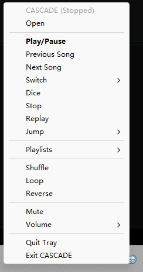

# CASCADE

**C**ommand-Line **A**udio **S**tream **C**apture **A**nd **D**ecoding **E**ngine


Retrieves collections of mechanically-represented wave data from persistent storage, decompartmentalizes their format-specific encapsulation, reconstitutes the original waveform through algorithmic reconstruction, and transmits the resulting signal to a computer-connected mechanical wave generator. Controlled via a teletype-like interactive interface. Supports automatic transition to the next data set or the beginning of the current data set upon completion, based on a configured mode.

(CLI music player. Lives in the terminal.)

## Features

- Play songs, playlists, or your entire library from the command line
- Library with metadata (including duration), aliases, and playlists (persisted in SQLite)
- Auto metadata extraction and alias binding from file tags
- Memorized playback position — resume where you left off
- Shuffle & Loop mode — Random or repeat
- Random song jump (`dice`)
- Dev mode — isolated development database
- Volume and mute control
- Media key control
- Tray icon: playback controls, song/playlist switching, volume presets, now-playing tooltip
- Dashboard frontend (`cascade dash`): interactive TUI with live status, playlist browsing and keyboard controls, including a poster mode that fills the screen with the album cover
- Use local or online lyric sources
- Download lyrics from online sources
- Lyric board: floating always-on-top window showing the current lyric line
- Configure GUI: edit configurations through an easy-to-use desktop window
- Pluggable audio engine: `vlc` (decodes everything VLC does) or `miniaudio` (default, needs no VLC installation, fewer formats) — see [Audio engines](#audio-engines)
- Socket-based backend/frontend architecture (see [docs/protocol.md](docs/protocol.md))

## Installation

Requires Python 3.12+. The default `miniaudio` engine needs no VLC; the `vlc` engine needs [VLC](https://www.videolan.org/vlc/) 3.x installed. CASCADE uses `python-vlc`, which is only a binding — it needs a real VLC runtime (`libvlc.dll` + plugins) to decode audio, found via VLC's installer or registry (see [Audio engines](#audio-engines)).

There are two ways to install:

### Option A — pip (recommended)

Install straight from the repository (needs `git`):

```bash
pip install git+https://github.com/askformeal/CASCADE.git
```

Or from a downloaded copy — a clone, or an unpacked ZIP — install it from the project directory:

```bash
git clone https://github.com/askformeal/CASCADE.git
cd CASCADE
pip install .
```

The `cascade` command will be available after installation. **Install it into a dedicated virtual environment**: the package ships a top-level `src` package, which collides with anything else that does the same in a shared interpreter.

For development, run from the repo root instead of installing:

```bash
python -m src
```

**With the `vlc` engine you must install [VLC](https://www.videolan.org/vlc/) yourself; the default `miniaudio` engine needs none.** CASCADE only ships the `python-vlc` binding; it locates the actual VLC runtime through VLC's installation.

### Option B — portable build (`build.sh`)

```bash
bash build.sh          # on Windows: from git-bash
```

Builds a self-contained folder (plus a `.zip`) into `dist/cascade-<version>/`, bundling a standalone CPython runtime, all dependencies, **and the VLC runtime** (a GUI-free subset — see `VLC_SRC` in `build.sh`). Launch with `cascade.cmd` in the bundle root; it can be copied to another machine and run as-is.

**No VLC installation needed** — the bundle ships its own. The target machine only needs the Microsoft Visual C++ 2015+ Redistributable (`vcruntime140.dll`), which most Windows systems already have.

## Usage

### Lifecycle

| Command                 | Description                                |
| ----------------------- | ------------------------------------------ |
| `cascade start`       | Start the CASCADE backend (daemon)         |
| `cascade start -c`    | Start backend and resume last session      |
| `cascade start --dev` | Start backend with dev database            |
| `cascade reboot`      | Restart the backend                        |
| `cascade reboot -c`   | Restart and resume last session            |
| `cascade exit`        | Stop the backend                           |
| `cascade kill`        | Force-kill backend processes (last resort) |
| `cascade status`      | Show current playback status               |

### Playback

| Command                  | Description                                                                                                                                   |
| ------------------------ | --------------------------------------------------------------------------------------------------------------------------------------------- |
| `cascade open <song>`  | Open a song, playlist, or file path                                                                                                           |
| `cascade play-all`     | Play all songs in the library                                                                                                                 |
| `cascade reload`       | Re-open the last opened song or play-all session                                                                                              |
| `cascade pause`        | Pause playing media                                                                                                                           |
| `cascade resume`       | Resume paused media                                                                                                                           |
| `cascade toggle`       | Switch between playing and paused                                                                                                             |
| `cascade stop`         | Stop playing                                                                                                                                  |
| `cascade prev`         | Switch to the previous song in current playlist                                                                                               |
| `cascade next`         | Switch to the next song in current playlist                                                                                                   |
| `cascade list`         | Show current playlist                                                                                                                         |
| `cascade dice`         | Switch to a random song in current playlist                                                                                                   |
| `cascade shuffle`      | Toggle shuffle mode                                                                                                                           |
| `cascade loop`         | Toggle loop mode                                                                                                                              |
| `cascade reverse`      | Toggle reverse playback mode                                                                                                                  |
| `cascade lyric`        | Toggle lyric source (local`.lrc` / online)                                                                                                  |
| `cascade switch <num>` | Switch to a song in current playlist via number                                                                                               |
| `cascade seek <time>`  | Jump to a specific time, or seek relative to the current position with a`+`/`-` prefix (e.g. `seek +10` forward, `seek -10` backward) |
| `cascade jump <pct>`   | Jump to progress of the current song (percentage)                                                                                             |
| `cascade replay`       | Clear memorized progress and replay the current song                                                                                          |
| `cascade volume <pct>` | Set volume (0-100), or adjust relatively with a`+`/`-` prefix (e.g. `volume +5`, `volume -5`)                                         |
| `cascade mute`         | Toggle mute                                                                                                                                   |

Note: the command-line parser treats a negative seek time, which starts with `-`, as an option flag. You can quote it to pass it through, e.g. `cascade seek "-1:30"`. Plain numbers like `seek -10` work without quotes.

### Library

| Command                                  | Description                                                                                                                                                                       |
| ---------------------------------------- | --------------------------------------------------------------------------------------------------------------------------------------------------------------------------------- |
| `cascade lib list`                     | Show all songs in library (`-a` aliases, `-p` playlists, `-t` tech metadata)                                                                                                |
| `cascade lib info <song>...`           | Show detailed info of songs (`-a` aliases, `-p` playlists, `-t` tech)                                                                                                       |
| `cascade lib search <kw>...`           | Search songs by name/artist/album/alias (`-o` any-keyword match)                                                                                                                |
| `cascade lib add <path>...`            | Add new songs to library (`-a/--aliases` to bind aliases, `--loose-path` to allow missing paths, `--skip-meta`/`--skip-alias`/`--skip-lyric` to disable auto-detection) |
| `cascade lib del <song>...`            | Delete songs from library (path, alias or ID)                                                                                                                                     |
| `cascade lib scan <dir>`               | Scan a directory for audio files and add them (`-d` dry run, `--skip-meta`/`--skip-alias`/`--skip-lyric`)                                                                 |
| `cascade lib prune`                    | Delete all songs whose file no longer exists (`-d` dry run)                                                                                                                     |
| `cascade lib reset`                    | Reset library and delete all data (confirmation)                                                                                                                                  |
| `cascade lib meta set`                 | Set metadata of a song (use`""` to clear)                                                                                                                                       |
| `cascade lib meta read-file`           | Set metadata of a song from its file tags (`--all` for every field)                                                                                                             |
| `cascade lib lyric set`                | Set the lyric file of a song (use`""` to unset)                                                                                                                                 |
| `cascade lib lyric offset <song> <ms>` | Set a per-song lyric time offset in milliseconds (positive delays the lyric, negative brings it earlier)                                                                          |
| `cascade lib lyric fetch <song>...`    | Fetch lyrics for songs from online sources (see`proxy` / `netease_skip_proxy` below)                                                                                          |
| `cascade lib alias ...`                | List/bind/unbind aliases (`bind <song> <alias>...`, `unbind <alias>...`)                                                                                                      |
| `cascade lib playlist ...`             | List/create/add/kick/delete playlists (`lib playlist list` supports `-a`/`-p`/`-t`)                                                                                       |

`cascade lib lyric fetch` downloads each song's lyric from an online source. Fetching several songs at once is slow and can exceed the frontend execution timeout (`execution_timeout`) — note that even if the request times out, the backend keeps downloading in the background and still writes the files. If you hit timeouts, raise `execution_timeout`; and keep to at most 4 songs per call, since downloads run with 4-way parallelism — beyond 4 they queue up instead of completing together.

> **Note for users on mainland China networks:** when fetching lyrics online, it is recommended to enable `netease_skip_proxy`. The NetEase source is reachable directly from China, while proxy-only sources (LRCLIB, Musixmatch, etc.) sit behind the wall — so let NetEase connect directly and route the rest through `proxy`.

`open` accepts a song alias, a library song name, a playlist name, or a file path.

If a song's lyric is slightly out of sync with the audio, you can shift it with a **lyric offset**. `cascade lib lyric offset <song> <ms>` persists a per-song offset in the library: a positive value delays the lyric line, a negative one brings it earlier. The dashboard also lets you nudge the *current* song live without persisting anything — `]` / `[` step a temporary overlay by `100ms` and `\` resets it. The persisted offset and the live overlay stack.

### Configuration

| Command                                 | Description                                                                                  |
| --------------------------------------- | -------------------------------------------------------------------------------------------- |
| `cascade config list`                 | Show information of all options                                                              |
| `cascade config show <option>`        | Show information of an option                                                                |
| `cascade config set <option> <value>` | Write an option to the config file (`--overwrite-corrupt` to replace a corrupted file)     |
| `cascade config unset <option>`       | Remove an option from the config file (falls back to default)                                |
| `cascade config gui`                  | Open the configure GUI                                                                        |
| `cascade config open`                 | Open the config file with the system's default application (creates an empty one if missing) |
| `cascade config path`                 | Show the path of the config file                                                             |

`config` commands accept `-d/--direct` to bypass the backend and edit the config file locally (works when the backend is not running, but cannot edit config files of remote backends). Its opposite, `--no-direct`, forces the backend route back on; passing neither leaves the choice to the command — for `config gui` that is the `config_default_remote` option.

See [docs/configuration.md](docs/configuration.md) for the config file and every option.

### Audio engines

| Engine                      | Requires                               | Decodes                               |
| --------------------------- | -------------------------------------- | ------------------------------------- |
| `vlc`                     | VLC 3.x installed                      | everything VLC does                   |
| `miniaudio` *(default)* | nothing beyond the Python dependencies | MP3, MP2, FLAC, WAV, AIFF, OGG Vorbis |

[miniaudio](https://github.com/mackron/miniaudio) lets CASCADE play without a VLC installation — but through a much smaller decoder. The AAC/M4A, WMA, Opus and AC3 families are not decodable, and neither are the lossless and rarer containers (APE, DSD, WavPack, ...). A song in one of those formats still scans into the library, and will fail at the moment it is opened, reported as "the audio file does not exist or is not valid".

`python-vlc` locates the VLC runtime the moment it is imported: it honours `PYTHON_VLC_LIB_PATH` (full path to `libvlc.dll`) and `PYTHON_VLC_MODULE_PATH` (plugin directory), then looks for an installed VLC through the registry and the usual `Program Files\VideoLAN\VLC` locations, and as a last resort tries `libvlc.dll` next to the working directory. If none of that works, the backend fails to start and `cascade.log` carries the reason — `Failed to access VLC backend`. A message about `Could not find module … (or one of its dependencies)` means `libvlccore.dll`, or the Microsoft Visual C++ 2015+ Redistributable it needs, is missing next to `libvlc.dll`. The portable build sets both environment variables itself and ships the runtime in `vlc/`, so moving that folder out of the bundle reproduces this error.

### Tray icon

The tray icon starts with the backend (unless the `tray` config option is off) and offers:

- Now-playing label and dynamic tooltip (song name + player status)
- Open — pick a song file with a file dialog (all supported audio types)
- Play/Pause (single-click), Previous/Next, Stop, Dice, Replay
- Switch submenu — jump to any song in the current playlist
- Playlists submenu — open any library playlist by name (plus `[Play All]`)
- Volume presets (0/25/50/75/100%), Mute, checkable Shuffle/Loop states
- The icon switches to an error variant for 1.5 s after a failed request



### Dashboard

The dashboard (`cascade dash`) is an interactive terminal UI. It shows the playback status, the songs in the current playlist, and information about the current song.

Screenshot:

```
╭──────────────────────────┬────────────────────────────────────────────────────────┬─────────────────────────────────────────────────────────────────╮
│  Information             │               CASCADE 0.43.0 Dashboard                 │  Playlist                                                       │
│                          │  ==================================================    │                                                           0 ↑   │
│  Duration: 00:04:26      │                                                        │  -[ Night Witches - Sabaton ]-                                  │
│                          │                  Inmate 4859 [4/13]                    │  No Bullets Fly - Sabaton                                       │
│  Name: Inmate 4859       │                                                        │  Smoking Snakes - Sabaton                                       │
│  Artist: Sabaton         │  █████████████████░░░░░░░░░░░░░ [00:02:29/00:04:26]    │  > Inmate 4859 - Sabaton <                                      │
│  Album: Heroes           │                                                        │  To Hell and Back - Sabaton                                     │
│                          │                                                        │  The Ballad of Bull - Sabaton                                   │
│  Bitrate: 1035.725 kbps  │  ████████████████████ [100%]               [Paused]    │  Resist and Bite - Sabaton                                      │
│  Sample Rate: 44100      │                                                        │  Soldier of 3 Armies - Sabaton                                  │
│  Channels: 2             │  ╭──────────────────────────────────────────────────╮  │  Far from the Fame - Sabaton                                    │
│                          │  │                     No Lyric                     │  │  Hearts of Iron - Sabaton                                       │
│  Aliases:                │  ╰──────────────────────────────────────────────────╯  │  7734 - Sabaton                                                 │
│    Inmate 4859           │                                                        │  Man of War - Sabaton                                           │
│                          │                                                        │  For Whom the Bell Tolls (Metallica Cover) - Sabaton            │
│  Playlists:              │                                                        │                                                           0 ↓   │
│    Heroes                │                                                        │                                                                 │
╰──────────────────────────┴────────────────────────────────────────────────────────┴─────────────────────────────────────────────────────────────────╯
```

Keys (defined in `DASH_KEY_MAP` in `src/constants/dash.py`):

| Key                            | Action                                                                                                                                   |
| ------------------------------ | ---------------------------------------------------------------------------------------------------------------------------------------- |
| `Space`                      | Play / pause                                                                                                                             |
| `Ctrl+A`                     | Play all songs in the library                                                                                                            |
| `Ctrl+R`                     | Reload the last opened song or play-all session                                                                                          |
| `o`                          | Open a song — prompts for a song name, library ID, file path or playlist name                                                           |
| `/`                          | Filter the playlist — prompts for text, matches against song name and artist; highlights matches and shows remaining counts above/below |
| `g`                          | Jump to a specific time — prompts for`HH:MM:SS`                                                                                       |
| `n` / `p`                  | Next / previous song                                                                                                                     |
| `j` / `k`, `↑` / `↓` | Move selection up / down                                                                                                                 |
| `PgUp` / `PgDn`            | Page selection up / down                                                                                                                 |
| `Home` / `End`             | Jump to top / bottom of the list                                                                                                         |
| `c`                          | Jump selection to the currently playing song                                                                                             |
| `Enter`                      | Play the selected song                                                                                                                   |
| `x` / `d`                  | Stop / random song jump                                                                                                                  |
| `s` / `r`                  | Toggle shuffle / loop                                                                                                                    |
| `b`                          | Toggle reverse playback                                                                                                                  |
| `z`                          | Toggle the lyric source (local`.lrc` / online)                                                                                         |
| `]` / `[`                  | Nudge the current lyric later / earlier (live overlay, step`100ms`; not persisted)                                                     |
| `\`                          | Reset the live lyric offset overlay                                                                                                      |
| `f`                          | Toggle poster mode (full-screen album cover)                                                                                             |
| `=` / `-`                  | Volume up / down (step from`dash_volume_step`)                                                                                         |
| `m`                          | Mute                                                                                                                                     |
| `,` / `h`, `←`          | Jump backward (step from`dash_pos_step`)                                                                                               |
| `.` / `l`, `→`          | Jump forward (step from`dash_pos_step`)                                                                                                |
| `t` / `T`                  | Next / previous box style (runtime only, not persisted)                                                                                  |
| `?` / `F1`                 | Toggle the key map help screen                                                                                                           |
| `Ctrl+L`, `F5`             | Redraw the screen                                                                                                                        |
| `q`, `Ctrl+C`, `Ctrl+Z`  | Quit the dashboard                                                                                                                       |

### Lyric board

The lyric board is a floating always-on-top window that shows the current lyric line of the playing song. It starts with the backend (unless the `lyric` config option is off) and follows the backend's playback state. Its font, color, size and screen position are configurable (see the `lyric_*` options in [docs/configuration.md](docs/configuration.md)). By default it rests at 40% opacity on a plain opaque backdrop and, when the mouse hovers over it, turns fully opaque with a solid background behind the text (`lyric_bg_color`). Both the hover solidification (`lyric_hover_solid`) and the transparent backdrop (`lyric_trans_bg`) can be turned off.


### Configure GUI

The configure GUI is a fixed-size window over the config file, making the options in [docs/configuration.md](docs/configuration.md) easy to set and unset.


It can read and write either through the backend or directly. **remote** sends `config.list` / `config.set` / `config.unset`, so it edits the config file of the machine the backend runs on; **local** does the same in-process, like the CLI's `--direct`, and needs no backend at all. The two routes differ only in whose `config.toml` is written. It starts in the mode `config_default_remote` selects — `remote` by default — and every row answers the mouse: the option's description on its name, the type a converter enforces on its value.

It is not spawned with the backend — start it yourself with `cascade config gui`, which takes `-d/--direct` / `--no-direct` to pick the initial mode and overrides `config_default_remote` for that launch.

In a portable build, `runtime\python.exe -m src.frontend.config_gui` from the bundle root. It logs to `cascade-config-gui.log`.

## Architecture

See [docs/architecture.md](docs/architecture.md) for the backend/frontend layout.

## Data

- Database: `%LOCALAPPDATA%\cascade\cascade\cascade.db` (Windows) — managed by platformdirs
- Dev database: `%LOCALAPPDATA%\cascade\cascade\cascade-dev.db` (Windows) — used when the backend is started with `--dev`
- Audio formats: FLAC, MP3, WAV, and other common formats (see `AUDIO_EXTENSIONS` in `src/constants/misc.py`) — which of them actually decode depends on the engine ([Audio engines](#audio-engines))

## Logs

Log file location (platform-dependent, managed by platformdirs):

| Platform | Path                                                                                                |
| -------- | --------------------------------------------------------------------------------------------------- |
| Windows  | `%LOCALAPPDATA%\cascade\cascade\Logs\cascade.log`                                                 |
| Linux    | `$XDG_STATE_HOME/cascade/log/cascade.log`, defaults to `~/.local/state/cascade/log/cascade.log` |
| macOS    | `~/Library/Logs/cascade/cascade.log`                                                              |

Log files: `cascade.log` (backend), `cascade-socket.log` (client/connection), `cascade-hotkey.log` (hotkey frontend), `cascade-tray.log` (tray frontend), `cascade-dash.log` (dashboard frontend), `cascade-lyric.log` (lyric board frontend), plus `cascade-config.log`, `cascade-config-gui.log`, `cascade-pid.log` and `cascade-util.log` (metadata and cover extraction from audio files).

## TODO

See [TODO.md](TODO.md) for planned features.

## Credits

Icon: [Cadence icons created by Three musketeers - Flaticon](https://www.flaticon.com/free-icons/cadence)

Lyric icon: [Lyrics icons created by Aranagraphics - Flaticon](https://www.flaticon.com/free-icons/lyrics)

Cover placeholder: [Image-placeholder icons created by Graphics Plazza - Flaticon](https://www.flaticon.com/free-icons/image-placeholder)

Uicons by [Flaticon](https://www.flaticon.com/uicons)

## License

MIT License, because using it is your loss.
