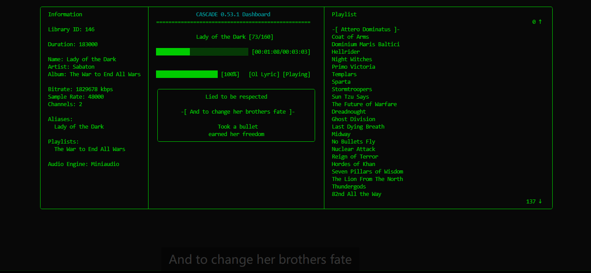
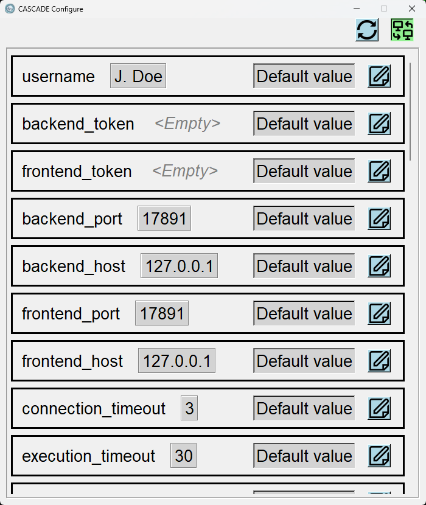

# CASCADE

**C**ommand-Line **A**udio **S**tream **C**apture **A**nd **D**ecoding **E**ngine


Retrieves collections of mechanically-represented wave data from persistent storage, decompartmentalizes their format-specific encapsulation, reconstitutes the original waveform through algorithmic reconstruction, and transmits the resulting signal to a computer-connected mechanical wave generator. Controlled via a teletype-like interactive interface. Supports automatic transition to the next data set or the beginning of the current data set upon completion, based on a configured mode.

(CLI music player. Lives in the terminal.)

## Highlights

- Daemon backend running in the background - control your playback across terminals
- Automatic online lyric 
- Remote control
- Pluggable audio engine: VLC / miniaudio

## Dependencies

- Python 3.12+
- VLC media player (if you want to use the VLC engine)
- [Third-party packages](requirements.in)

## Installation

### Option A - pip (recommended)

Install straight from the repository (needs `git`):

```bash
pip install git+https://github.com/askformeal/CASCADE.git
```

Or from a downloaded copy, from the project directory:

```bash
git clone https://github.com/askformeal/CASCADE.git
cd CASCADE
pip install .
```

**With the `vlc` engine you must install [VLC](https://www.videolan.org/vlc/) yourself; the default `miniaudio` engine needs none.**

### Option B - portable build (`build.sh`)

```bash
bash build.sh          # on Windows: from git-bash
```

Builds a self-contained folder (plus a `.zip`) into `dist/cascade-<version>/`, bundling a standalone CPython runtime, all dependencies, **and the VLC runtime** (a GUI-free subset - see `VLC_SRC` in `build.sh`). Launch with `cascade.cmd` in the bundle root; it can be copied to another machine and run as-is.

**No VLC installation needed** - the bundle ships its own.

## Screenshots

### Dashboard TUI
```
╭──────────────────────────────────────┬────────────────────────────────────────────────────────┬─────────────────────────────────────────────────────────────────────────╮
│  Information                         │               CASCADE 0.54.0 Dashboard                 │  Playlist                                                               │
│                                      │  ==================================================    │                                                                   0 ↑   │
│  Library ID: 16                      │                                                        │  > -[ Attero Dominatus ]- <                                             │
│                                      │               Attero Dominatus [1/160]                 │  Coat of Arms                                                           │
│  Duration: 00:03:43                  │                                                        │  Dominium Maris Baltici                                                 │
│                                      │  ████░░░░░░░░░░░░░░░░░░░░░░░░░░ [00:00:29/00:03:43]    │  Hellrider                                                              │
│  Name: Attero Dominatus              │                                                        │  Night Witches                                                          │
│  Artist: Sabaton                     │                                                        │  Primo Victoria                                                         │
│  Album: Attero Dominatus (Re-Armed)  │  ████████████████████ [100%]    [Ol Lyric] [Paused]    │  Templars                                                               │
│                                      │                                                        │  Sparta                                                                 │
│  Bitrate: 1051.179 kbps              │  ╭──────────────────────────────────────────────────╮  │  Stormtroopers                                                          │
│  Sample Rate: 44100                  │  │                     Interimo!                    │  │  Sun Tzu Says                                                           │
│  Channels: 2                         │  │                                                  │  │  The Future of Warfare                                                  │
│                                      │  │            -[ The reich has fallen ]-            │  │  Dreadnought                                                            │
│  Aliases:                            │  │                                                  │  │  Ghost Division                                                         │
│    Attero Dominatus                  │  │          We stand at the gates of Berlin         │  │  Last Dying Breath                                                      │
│                                      │  │          With two and a half million men         │  │  Midway                                                                 │
│  Playlists:                          │  ╰──────────────────────────────────────────────────╯  │  No Bullets Fly                                                         │
│    Attero Dominatus                  │  Play/Pause                                            │  Nuclear Attack                                                         │
│                                      │                                                        │                                                                 143 ↓   │
│  Audio Engine: Miniaudio             │                                                        │                                                                         │
╰──────────────────────────────────────┴────────────────────────────────────────────────────────┴─────────────────────────────────────────────────────────────────────────╯
```

(Yep, that's Sabaton you are seeing)

### Floating lyric



### Configure GUI



## TODO

See [TODO.md](TODO.md) for planned features.

## Credits

Icon: [Cadence icons created by Three musketeers - Flaticon](https://www.flaticon.com/free-icon/musical_16496971)

Lyric icon: [Lyrics icons created by Aranagraphics - Flaticon](https://www.flaticon.com/free-icon/document_10305758)

Cover placeholder: [Image-placeholder icons created by Graphics Plazza - Flaticon](https://www.flaticon.com/free-icon/image_9261181)

Uicons by [Flaticon](https://www.flaticon.com/uicons)

## License

MIT License, because using it is your loss :)
